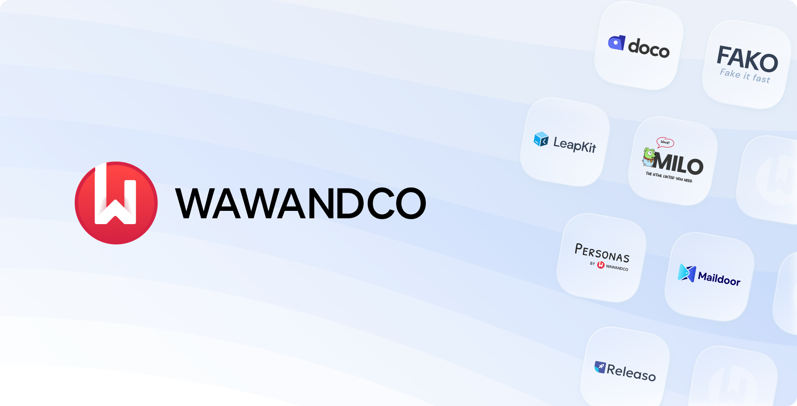

## **💰Cost-effective - ⭐️High-quality - 🚀Growth-oriented - 🤝Collaborative**

# Unlock your business potential with `cost-effective` software solutions
At [Wawandco](https://wawand.co), we help companies achieve goals through technology solutions. Whether it implies exploring a new market opportunity or a rescue mission we're here to help.

### Contact Us ℹ️
We're ready to integrate with your teams to fulfill your business goals with our experience 😎 [Get in touch now](https://wawand.co/contact/)!

## Resources & Open Source Tools 🧰
A list of tools we have created to help you thrive in your professional initiatives ✨

[🧍 Personas: Unmask your ideal customers](https://personas.wawand.co/)

[🚢 Releaso: Build stronger product-user relationships](https://releaso.com/)

[📘 The Good Guide to Effective Product Updates](https://releaso.com/blog)

[🏭 Fako: Fake it Fast](https://github.com/wawandco/fako)

[🐶 Milo: Your free linting BFF](https://github.com/wawandco/milo)

[🎒 LeapKit: Your next Go App in a Leap](https://leapkit.dev/)

[📖 Doco: Docs, Simplified](https://doco.sh/)
